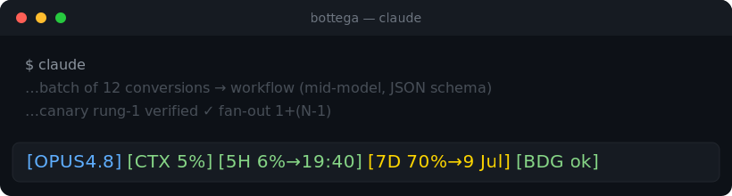

# 🎬 fable-director

**Governance dei token per Claude Code.** Il top model dirige — pianifica, giudica, verifica — e manda l'esecuzione al mezzo più economico adeguato: prima uno script deterministico, poi un modello medio, il top model solo dove serve davvero.

  

> Come nella bottega rinascimentale: il maestro disegna e rifinisce, gli apprendisti eseguono, la bottega accumula mestiere. Il plugin porta questa disciplina dentro Claude Code — in modo **misurabile** e **imposto da hook**, non affidato alla buona volontà.

---

## Il problema

Un agente potente tende a fare *tutto* con sé stesso: legge file enormi, ripete lavoro deterministico che uno script farebbe a costo zero, delega a raffica senza sapere se conviene, brucia context. Il costo esplode e non te ne accorgi finché non arriva il conto (o il rate limit).

## La soluzione

fable-director inietta una **policy di routing sempre attiva** e la fa **rispettare da hook deterministici**. Non è un consiglio nel prompt che il modello può ignorare: è enforcement.

---

## ⭐ Vantaggi in breve

| | Vantaggio | Come |
|---|---|---|
| 🧭 | **Ogni task va sul mezzo giusto** | Kernel a 6 assi di routing iniettato a ogni sessione (~500 token): inline vs delega vs script vs workflow, con override d'ordine chiaro |
| 💰 | **Lavoro deterministico a costo zero** | La policy spinge a promuovere il lavoro ripetibile in script — zero token di modello invece di N chiamate |
| 🛡️ | **Budget imposto, non suggerito** | Pre-budget machine-readable + hook `Stop` che blocca in modo deterministico a 3× e obbliga il post-mortem. Anti-Goodhart per costruzione |
| 📊 | **Telemetria reale, zero overhead** | Hook `SessionEnd` logga token, cache hit ratio, overhead di delega su SQLite — senza spendere token di modello |
| 🧠 | **La bottega impara** | Playbook di euristiche che sopravvive agli update: `[candidata]` → confermata alla 2ª occorrenza, contatori uses/ok/ko |
| 📟 | **Sai sempre a che punto sei** | Statusline con modello, context %, quota piano 5h e 7d con orari di reset, stato budget |
| 🧾 | **Rendiconto token onesto** | Report dai transcript JSONL reali: costo per modello/main/subagenti, metriche cache, flag ≥3× |

---

## 📟 La statusline

Un colpo d'occhio su modello, context e quote di piano — così sai quando stai per sbattere sul rate limit **prima** che succeda:



```
[OPUS4.8] [CTX 5%] [5H 6%→19:40] [7D 70%→9 lug] [BDG ok]
```

- `[OPUS4.8]` modello attivo
- `[CTX 5%]` riempimento context window della conversazione
- `[5H 6%→19:40]` quota piano finestra 5 ore + orario di reset locale (la "Current session" di `/usage`)
- `[7D 70%→9 lug]` quota settimanale + data di reset
- `[BDG ok]` stato del pre-budget fable-director (`ok` / `2×` / `3×`)

Soglie colore 60/80. Se hai il plugin **caveman**, il suo badge resta davanti.

**Abilitala con un comando** (idempotente, merge-safe, path auto-risolto per ogni macchina):

```
/fable-director:statusline
```

Poi riavvia Claude Code. `--remove` per toglierla. Non tocca una statusLine di terzi già presente e fa backup di `settings.json`.

---

## 🚀 Installazione

**Da questo repo:**

```bash
claude plugin marketplace add frsorrentino/fable-director
claude plugin install fable-director@pixelfarm --scope user
```

Poi:

1. Inizializza il playbook (una tantum, vive fuori dal plugin così gli update non lo toccano):
   copia `fable-director/playbook-template.md` in `~/.claude/delega-playbook.md`.
2. Abilita la statusline: `/fable-director:statusline` → riavvia Claude Code.

Dettagli completi, merge degli hook a mano e casi limite in **[INSTALL.md](INSTALL.md)**.

---

## 🧭 I 6 assi di routing

Il kernel decide dove va ogni task, con precedenza dall'alto (un asse più in alto vince):

1. **Interattività** — live / visivo / iterazione con l'utente? → top model inline, mai delega.
2. **Costo dell'errore** — codice in produzione, numeri/testo verso il cliente, scritture irreversibili? → top model. Nel dubbio *è* sensibile alla qualità.
3. **Determinismo** — il cuore lo fa il codice? → script, zero token di modello.
4. **Cardinalità** — N item simili? → workflow con modello medio raggruppato, schema JSON forzato, fan-out 1+(N-1): una canary verificata **prima** delle altre.
5. **Verificabilità** — test oggettivo? → assert deterministici; se no → verifica avversariale per finding.
6. **Località di cache** — ogni subagente paga un cold start; cambiare modello invalida la cache. Veto di costo sulle rotte borderline.

**Mai delegare:** debugging interattivo, estetica, numeri/testo verso il cliente, scritture in produzione senza backup.

---

## 🧩 Componenti

| Pezzo | Ruolo |
|---|---|
| **Kernel** (hook SessionStart) | Inietta i 6 assi + never-delegate a ogni sessione, ~500 token |
| **Skill `delega-efficiente`** | Policy completa on-demand: delegation contract, pre-budget falsificabile, rule-of-3 best-of-3, promozione script, regole playbook |
| **Hook `Stop` (budget-check)** | Enforcement deterministico del 3×: confronta token effettivi col budget aperto, blocca la chiusura del turno e impone il post-mortem |
| **Hook `SessionEnd` (telemetria)** | Logga token e metriche cache/delega su SQLite, zero token di modello |
| **Playbook** | Euristiche apprese che sopravvivono agli update |
| **`session-cost-report.py`** | Rendiconto token dai transcript JSONL reali |
| **Statusline + installer** | `/fable-director:statusline` scrive la statusLine in settings.json, idempotente e merge-safe |

Architettura: **kernel leggero always-on** (poco context ogni sessione) + **corpo pesante on-demand** (caricato solo quando gli assi scattano) + **enforcement esterno via hook** (deterministico, non aggirabile dal modello).

---

## 🤝 Dipendenze soft

Funziona da solo. Con i plugin [`caveman`](https://github.com/JuliusBrussee/caveman) (output compresso, `/caveman-stats`) e [`superpowers`](https://github.com/obra/superpowers-marketplace) (systematic-debugging, brainstorming) rende al meglio, degradando con grazia se assenti.

## Requisiti

- Claude Code ≥ 2.1.x (per i campi `context_window`/`rate_limits` nella statusline; su versioni prive degrada in silenzio)
- `python3` e `bash` nel PATH

## Licenza

[MIT](LICENSE) © 2026 Pixelfarm
