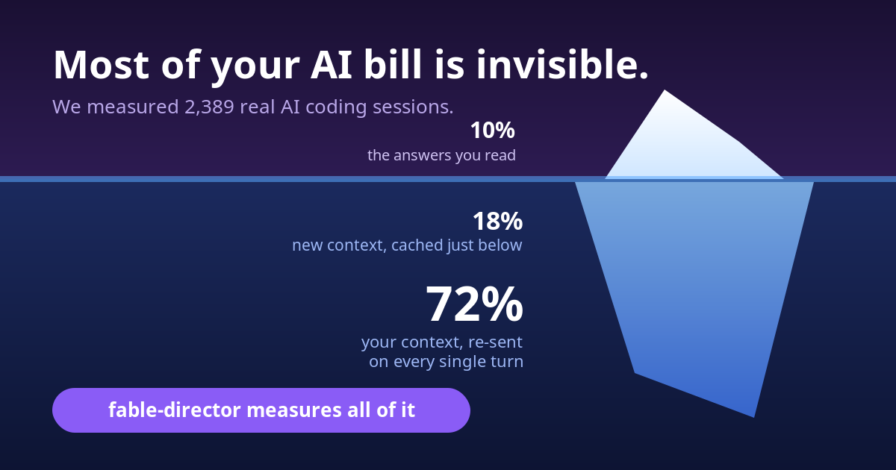
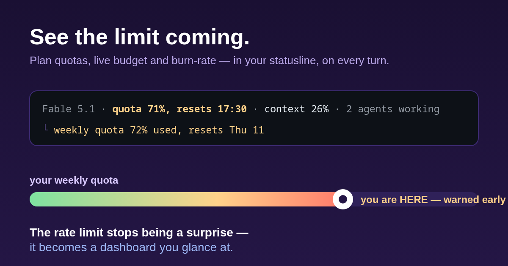

# 🎬 fable-director

  

**Keeps Claude Code from spending your quota on work the top model didn't need
to do.** It makes your agent declare what a job should cost before it delegates,
routes the cheap parts to cheap executors, and blocks the turn when spend runs
away — with quality as a constraint, never part of the trade.

**The honest price:** the always-on checks are a premium on small work — **~5%
to ~20%** on quick one-off tasks (shape-dependent, N small), and up to **+47%**
on easy self-contained bug fixes (measured on SWE-bench, where the discipline
had nothing to protect). If your work is mostly small and easy, this plugin is
not for you.

## What's new

| [](#video-and-audio-at-zero-claude-tokens) | [![What leaves the machine carries placeholders, not people: values stay in a local map, the model sees [PERSONA_1] [TEL_1] [CF_1] [IBAN_1], restore puts every value back byte-exact.](assets/readme/card8-anonymizer.png)](#anonymizer-placeholders-not-people) |
|---|---|
| **1.42 — video and audio** at zero Claude tokens: contact sheets, local transcription, timed scripts, free tier for the long clips. [Read more ↓](#video-and-audio-at-zero-claude-tokens) | **1.44 — anonymizer**: pseudonymise what leaves the machine, byte-exact restore, Italian pack with check digits, exports by column. Phase A, a CLI, off by default; the hook into the external routes comes next. [Read more ↓](#anonymizer-placeholders-not-people) |

## Quickstart

```bash
claude plugin marketplace add frsorrentino/fable-director
claude plugin install fable-director@pixelfarm --scope user
```

Then two one-off steps:

1. Copy `fable-director/playbook-template.md` to `~/.claude/delega-playbook.md`
   — the playbook lives outside the plugin so updates never touch it.
2. Enable the statusline: `/fable-director:statusline`, then restart Claude Code.

From the first session the plugin **enables its own auto-update** (announced
in-session, reversible: set `"autoUpdate": false` under
`extraKnownMarketplaces.pixelfarm` in `settings.json`, and that choice is
respected forever). No-CLI alternative and zip migration:
**[ONBOARDING.md](ONBOARDING.md)**. Manual hook merge and edge cases:
**[INSTALL.md](INSTALL.md)**.

## What you get

- **Same cost, better result on the jobs that eat your quota** — on big reading
  jobs tokens are neutral and quality is consistently higher (N=6/5); ~20% fewer
  tokens on repetitive mechanical work.
- **Your agent can't quietly overspend or write where you didn't allow** — it
  declares an estimate and a write perimeter before delegating; a hook blocks
  the turn at 3× the estimate and denies writes outside the paths (your
  `never_write` patterns always). You find out while it happens, not when the
  limit hits.
- **The job you run every week stops costing you** — repeatable work is promoted
  to a script; from the second run it's close to free.
- **Bulk work leaves your Claude quota, sensitive work never leaves your
  machine** — non-code batches and verification can run on free external
  models; mark a task restricted and those routes refuse to run,
  deterministically.
- **A long session ends on your terms, not at the wall** — when a task closes
  and the context is getting heavy, the agent asks whether to write a two-page
  handoff and start fresh; the next session reads it at startup instead of
  re-paying the whole context (a cold reopen measured 296k tokens).

What a governed job looks like: you ask for the 240 reviews to be classified;
the agent declares a price (`budget-open`, ~60k tokens, one canary first),
delegates the batch to a cheap pinned executor, checks the canary before the
rest, and the Stop hook warns at 2× and blocks the turn at 3× until a
post-mortem is written. A small quick task skips all of this.

## How much does it save?



**The honest one-sentence answer:** it doesn't save tokens on every task — it
makes spend predictable, verified and disciplined; on read-heavy loads the
tokens are neutral and the quality is higher, and the real savings come from
the jobs it scripts or routes off your quota.

Measured by running the **same tasks with and without the plugin**, several
times each, counting real tokens and real dollars:

| Kind of work | With the plugin | Verdict |
|---|---|---|
| **Big reading jobs** (240 long customer reviews) | Same result in 3-7 steps instead of 3-32; tokens and dollars **neutral** (−2.6% ±35%, N=6/5), **quality consistently higher** (sentiment 99% vs 94%, safety recall 98% vs 95%) | 🛡️ same cost, better result |
| **Repetitive mechanical work** (30 data files) | **~20% fewer tokens**, near-identical behavior every run | ✅ saves |
| **Quick small tasks** (one question, one small fix) | **~5% to ~20% more** — the fixed price of the always-on checks | ➖ small premium |
| **Recurring jobs** (the same task every week) | The repeatable core becomes a script: from the second run, **that job** is close to free | ✅ the biggest saving |
| **Non-code batches** (classify, extract, transform) | The bulk runs on free external models | ✅ off your Claude quota |
| **Real-world bug fixing** (SWE-bench Verified, official grader) | Easy issues: +47% premium. Hard issues: **same tokens, nothing lost, 2 extra resolved**, zero runaway runs | 🛡️ insurance that pays off on hard work |

The deep cuts apply to **specific jobs the plugin can script or route
externally**, not to your Claude usage as a whole; the last two rows are where
the design aims, and they compound over weeks. Measure your own work:

```bash
python3 fable-director/skills/delega-efficiente/tools/session-cost-report.py
```

**The full data is published, negative numbers included** — method, per-run
tables, variance, the run that died on a session limit, the three findings
behind the percentages, and what the harness *can't* measure:
**[benchmarks/](benchmarks/)**. Anthropic's own 2026-09-08 note on cost lands
on the same levers the plugin measures; where each one lives here:
**[docs/INTERNALS.md](docs/INTERNALS.md#what-anthropic-confirmed-2026-09-08)**.

## What is actually enforced

The distinction matters, so it's stated plainly: **hooks enforce, policy
advises.**


Enforced deterministically, on your machine: delegation without an open budget
is denied; spend past 3× blocks the turn until a post-mortem is written; writes
outside the declared paths are denied, and so are the destructive git commands
you deny-list; `--data-class restricted` blocks the external routes. Advisory:
the routing axes themselves, the never-delegate rules, script promotion and the
playbook — they guide the model's decisions without forcing a route. The full
table, the hook-by-hook lifecycle and the known limits:
**[docs/INTERNALS.md](docs/INTERNALS.md)**.

## The statusline

```
Fable 5.1 · quota 21%, resets 17:30 · context 26%                  caveman
```

Model, five-hour plan quota with its reset time, context — the three numbers
that are your margin, always on screen — so you see the rate limit coming
**before** it hits. Everything else shows up only when there is something to
do, in words, most urgent first (`quota 92% used, resets in 40 min · context
83% full — finish the task and start a new session`).



`/fable-director:statusline` installs it; on a phone or web client
`/fable-director:status` prints the same state as text; the dense line is the
optional expert mode. Every segment: **[docs/STATUSLINE.md](docs/STATUSLINE.md)**.

## Video and audio, at zero Claude tokens

A client sends a 68-second spot, a voice-over script with timings, a folder of
clips to compare. Until 1.42 your agent either guessed what was in them or spent
your quota reading frames one at a time. Now:

- **One image instead of dozens of screenshots.** A clip becomes a single
  contact sheet with the time printed on every frame; one frame per cut gives
  the shot list — 19 cuts, one sheet, zero tokens.
- **Speech to text on your own CPU.** 68 s of Italian speech transcribed in
  76 s, as subtitles or word-level JSON; the voice-over script is timed before
  the studio. Nothing uploaded, nothing billed.
- **A long video no longer eats your afternoon's quota.** When one sheet is not
  enough, the heavy reading goes to a free tier at zero Claude tokens; you see
  the price before it runs, the result is checked before use, and material
  under NDA never leaves your machine.
- **Checked and cached.** Silent clips are called silent before anything runs;
  sheets and transcripts are cached per file, so the second look is free.

Setup once: `media-doctor.py --setup`. The `analisi-video` skill drives the rest.

## Anonymizer: placeholders, not people

Since 1.44 the `anonymizer` package pseudonymises text before it leaves the
machine: values stay in a local map (mode 0600), the text carries stable
`[EMAIL_3]`, `[PERSONA_7]`, `[IBAN_1]` placeholders, and `restore` puts every
value back, byte-exact. Three engines, stdlib only: **rules** (Italian pack
with check digits), **columns** (CSV/TSV/JSON exports, one placeholder per
cell of a known header), **dictionary** (your clients, contacts and domains,
per project). Off by default; nothing personal in logs or reports. Phase A is
the CLI (`scan`, `redact`, `restore`, `test`, `status`): the hook into the
external routes comes next, the NER for names after that — until then a name
outside your dictionary and outside a known column is **not** seen. Demo,
commands, measurements and plan: **[docs/anonymizer-demo.md](docs/anonymizer-demo.md)**,
**[docs/plans/2026-09-09-anonymizer.md](docs/plans/2026-09-09-anonymizer.md)**.

## External free-tier models

Have a Google or ChatGPT account? Their free tiers reset daily, and
fable-director can use them for two jobs off your Claude quota: an independent
verifier from a different model family (uncorrelated blind spots), and an
executor for non-code batches. Ledgers stay separate, an unavailable provider is
never treated as verified, and `--data-class restricted` blocks the route
outright. Setup and guarantees: **[docs/EXTERNAL-MODELS.md](docs/EXTERNAL-MODELS.md)**.

## Soft dependencies

Works on its own. These optional companions save further tokens and degrade
gracefully when absent.

- **[`chrome-bridge`](https://github.com/frsorrentino/chrome-bridge)** — browser
  automation (same author): zero-token CLI lane, **2.3–2.8× fewer tokens** than
  the official Chrome extension. Routed by the kernel out of the box.
- **[`caveman`](https://github.com/JuliusBrussee/caveman)** — compressed output
  style, **~65% fewer output tokens** (measured).
- **[`superpowers`](https://github.com/obra/superpowers-marketplace)** — process
  discipline: a well-framed task delegates better.

## Documentation

- [docs/INTERNALS.md](docs/INTERNALS.md) — routing axes, hooks, components, what it learns, what Anthropic confirmed, known limits
- [docs/STATUSLINE.md](docs/STATUSLINE.md) — every segment and alarm state
- [docs/EXTERNAL-MODELS.md](docs/EXTERNAL-MODELS.md) — Gemini and Codex setup
- [docs/anonymizer-demo.md](docs/anonymizer-demo.md) · [docs/plans/2026-09-09-anonymizer.md](docs/plans/2026-09-09-anonymizer.md) — anonymizer demo, architecture, phases, measurements
- [benchmarks/](benchmarks/) — full measurement data
- [INSTALL.md](INSTALL.md) · [ONBOARDING.md](ONBOARDING.md) · [CHANGELOG.md](CHANGELOG.md)

## Requirements

Claude Code ≥ 2.1.x (for the `context_window` / `rate_limits` statusline fields;
older versions degrade silently), `python3` and `bash` on the PATH; `ffmpeg`
and `ffprobe` only for the video and audio tools (`media-doctor.py` checks
them). Keep
`maxEffortLevel` at or above `high`, or set it per model: a lower cap silently
overrides the verifier's pinned tier
([INTERNALS](docs/INTERNALS.md#claude-fable-51-and-claude-code-21257--what-changed-what-didnt-2026-09)).

## License

[MIT](LICENSE) © 2026 Francesco Sorrentino
