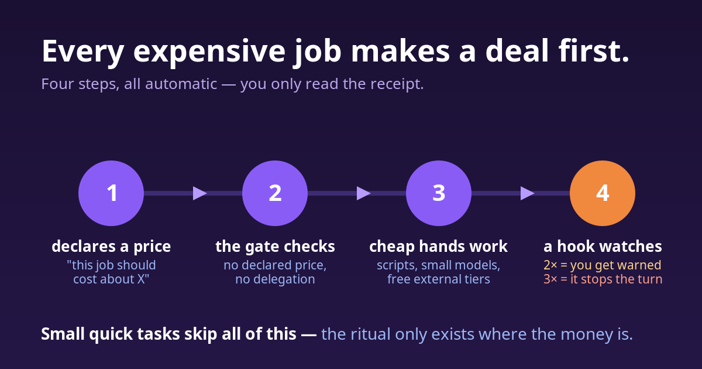

# 🎬 fable-director

  

**Keeps Claude Code from spending your quota on work the top model didn't need
to do.** It makes your agent declare what a job should cost before it delegates,
routes the cheap parts to cheap executors, and blocks the turn when spend runs
away — with quality as a constraint, never part of the trade.

**The honest price:** the always-on checks are a premium on small work — **~5%
to ~20%** on quick one-off tasks (shape-dependent, N small), and up to **+47%**
on easy self-contained bug fixes (measured on SWE-bench, where the discipline
had nothing to protect). If your work is mostly small and easy, this plugin is
not for you.

## Quickstart

```bash
claude plugin marketplace add frsorrentino/fable-director
claude plugin install fable-director@pixelfarm --scope user
```

Then two one-off steps:

1. Copy `fable-director/playbook-template.md` to `~/.claude/delega-playbook.md`
   — the playbook lives outside the plugin so updates never touch it.
2. Enable the statusline: `/fable-director:statusline`, then restart Claude Code.

From the first session the plugin **enables its own auto-update** (announced
in-session, reversible: set `"autoUpdate": false` under
`extraKnownMarketplaces.pixelfarm` in `settings.json`, and that choice is
respected forever). No-CLI alternative and zip migration:
**[ONBOARDING.md](ONBOARDING.md)**. Manual hook merge and edge cases:
**[INSTALL.md](INSTALL.md)**.

## What you get

- **Same cost, better result on the jobs that eat your quota** — on big reading
  jobs tokens are neutral and quality is consistently higher (N=6/5); ~20% fewer
  tokens on repetitive mechanical work.
- **The job you run every week stops costing you** — repeatable work is promoted
  to a script; from the second run it's close to free.
- **Your agent can't quietly overspend** — it declares an estimate before
  delegating, and a hook blocks the turn at 3× it. You find out while it
  happens, not when the limit hits.
- **Bulk work leaves your Claude quota** — non-code batches and verification can
  run on free external models; Claude keeps the planning and the checking.
- **The agent can't write where you didn't allow it** — a task declares which
  paths it may touch; anything outside is denied, and your `never_write`
  patterns always are.
- **Sensitive work never leaves your machine** — mark it restricted and the
  external routes refuse to run, deterministically.
- **The same mistake doesn't cost twice** — a job that already blew its estimate
  says so at session start, on the project where it happened.
- **You see what you actually spend** — the telemetry counts the real cost
  of every turn, not just the tokens that are easy to see.
- **A long session ends on your terms, not at the wall** — when a task closes
  and the context is getting heavy, the agent asks whether to write a two-page
  handoff and start fresh; the next session reads it at startup instead of
  re-paying the whole context (a cold reopen measured 296k tokens).



## New in 1.42 — video and audio, at zero Claude tokens

A client sends a 68-second spot, a voice-over script with timings, a folder of
clips to compare. Until now your agent either guessed what was in them or spent
your quota reading frames one at a time. Now:

- **One image instead of dozens of screenshots.** A 68 s clip becomes a single
  contact sheet with the time printed on every frame; the model reads the whole
  video in one look. Ask for one frame per cut and you get the shot list: 19
  cuts, one sheet, zero tokens.
- **Speech to text on your own CPU.** 68 s of Italian speech transcribed in
  76 s, as subtitles or JSON, word by word if you need to sync graphics.
  Nothing is uploaded, nothing is billed.
- **The script is timed before the studio.** Paste the voice-over with its
  planned slots and get each line's real length: the "4 seconds" that takes
  5.9 shows up now, not at the recording session.
- **Silent clips are called silent.** Whether a file has audio is checked with
  `ffprobe` before anything runs. We watched a model "transcribe" the burnt-in
  subtitles of a clip with no audio track; that mistake is now impossible.
- **A long video no longer eats your afternoon's quota.** When one sheet is not
  enough, the heavy reading goes to a free Gemini tier: a 10 MB clip costs you
  zero Claude tokens, you see the price before it runs, and the result is
  checked before it is used. Client material under NDA? Say so once and it
  never leaves your machine.
- **The second look is free.** Sheets and transcripts are cached per file;
  reopen the same clip next week and it is instant.

Setup once: `media-doctor.py --setup`. The `analisi-video` skill drives the rest.

## How much does it save?


**The honest one-sentence answer:** it doesn't save tokens on every task — it
makes spend predictable, verified and disciplined, and on read-heavy loads it
cuts about a quarter of the tokens without giving up quality.

Measured by running the **same tasks with and without the plugin**, several
times each, counting real tokens and real dollars:

| Kind of work | With the plugin | Verdict |
|---|---|---|
| **Big reading jobs** (240 long customer reviews) | Same result in 3-7 steps instead of 3-32; tokens and dollars **neutral** (−2.6% ±35%, N=6/5 — indistinguishable from zero), **quality consistently higher** (sentiment 99% vs 94%, safety recall 98% vs 95%) | 🛡️ same cost, better result |
| **Repetitive mechanical work** (30 data files) | **~20% fewer tokens**, near-identical behavior every run | ✅ saves |
| **Quick small tasks** (one question, one small fix) | **~5% to ~20% more** — the fixed price of the always-on checks, larger on tiny shapes | ➖ small premium |
| **Quality of results** | Equal or better everywhere it saves (98% vs 95%); never traded for savings | 🛡️ protected |
| **Recurring jobs** (the same task every week) | The repeatable core becomes a script: from the second run, **that job** is close to free | ✅ the biggest saving |
| **Non-code batches** (classify, extract, transform) | The bulk runs on free external models | ✅ off your Claude quota |
| **Real-world bug fixing** (SWE-bench Verified, official grader) | Easy issues: +47% premium. Hard issues: **same tokens, nothing lost, 2 extra resolved**, zero runaway runs | 🛡️ insurance that pays off on hard work |

To be clear: the deep cuts apply to **specific jobs the plugin can script or
route externally**, not to your Claude usage as a whole. At equal model a
single-shot benchmark sees **equal cost and higher quality**, not fewer tokens
(`benchmarks/README.md`, consolidated N=6/5); the last two rows are where the
design aims, and they compound over weeks.

*(These numbers count tokens — the visible part. The real bill is dominated
by context re-sending: measured and managed since 1.33.0.)*

Three findings worth more than the percentages:

- **The top model already delegates on its own — chaotically.** Even with no
  plugin it hands work to cheaper models. The value isn't *making delegation
  happen*: it's making it **disciplined** — 3-7 steps instead of 3-32, explicit
  specs, checked results, and a brake that caught a 26× wrong cost estimate
  *during* the benchmark.
- **It knows when NOT to hand work around.** On a task of 40 tiny items it
  correctly refused to delegate: splitting work that small costs more than it
  saves.
- **Most of your bill is invisible.** We audited 2,389 real sessions: ~72%
  of the cost is your context being re-sent on every turn — output tokens
  are just 10%. Since 1.33.0 the plugin measures and optimizes the cost you
  actually pay, not the one that's easy to count.
- **The discipline pays exactly where work is hard.** On SWE-bench Verified
  (official grader, on/off arms) the baseline went into a tailspin twice on hard
  issues — 100 turns, 384k tokens burned without resolving, 54% of its entire
  hard-set cost. The plugin arm never touched the guardrails, matched the token
  count, lost nothing and resolved 2 extra issues. On easy issues the same checks
  are pure overhead (+47%): it's insurance — you pay a premium on the small stuff
  so the big stuff can't blow up. Full reports:
  **[benchmarks/swebench/](benchmarks/swebench/)**.

**Don't take our word for it — measure your own work:**

```bash
python3 fable-director/skills/delega-efficiente/tools/session-cost-report.py
```

**The full data is published, negative numbers included** — method, per-run
tables, variance (±33% on the read-heavy shape), the run that died on a session
limit, and what the harness *can't* measure: **[benchmarks/](benchmarks/)**. One
of the four shapes came out at **−5.1%**; it's in there too.

## What is actually enforced

The distinction matters, so it's stated plainly: **hooks enforce, policy
advises.**


Enforced deterministically, on your machine: delegation without an open budget
is denied; spend past 3× blocks the turn until a post-mortem is written; writes
outside the declared paths are denied, and so are the destructive git commands
you deny-list; `--data-class restricted` blocks the external routes. Advisory: the routing axes themselves, the never-delegate
rules, script promotion and the playbook — they guide the model's decisions
without forcing a route.

The full table, the hook-by-hook lifecycle and the known limits are in
**[docs/INTERNALS.md](docs/INTERNALS.md)**.

## The statusline

```
Fable 5.1 · quota 21%, resets 17:30 · context 26%                  caveman
```

Model, five-hour plan quota with its reset time, context — the three numbers
that are your margin, always on screen — so you see the rate limit coming
**before** it hits. Everything else shows up only when there is something to
do, in words, most urgent first:

```
Fable 5.1 · quota 92%, resets 17:30 · context 83%
└ quota 92% used, resets in 40 min · context 83% full — finish the task and start a new session
```

`/fable-director:statusline` installs it; on a phone or web client
`/fable-director:status` prints the same state as text. The dense historic
line (`ctx ▓▓▓░░░░░ 26%/1M · 5H 71% 17:30 · bdg ▓░░ 0.7×·high · dlg ≡ 41k`)
is the optional **expert mode**.


Every segment explained: **[docs/STATUSLINE.md](docs/STATUSLINE.md)**.

## External free-tier models

Have a Google or ChatGPT account? Their free tiers reset daily, and
fable-director can use them for two jobs off your Claude quota: an independent
verifier from a different model family (uncorrelated blind spots), and an
executor for non-code batches. Ledgers stay separate, an unavailable provider is
never treated as verified, and `--data-class restricted` blocks the route
outright.

Setup and guarantees: **[docs/EXTERNAL-MODELS.md](docs/EXTERNAL-MODELS.md)**.

## Soft dependencies

Works on its own. These optional companions save further tokens and degrade
gracefully when absent.

- **[`chrome-bridge`](https://github.com/frsorrentino/chrome-bridge)** — browser
  automation (same author): zero-token CLI lane, **2.3–2.8× fewer tokens** than
  the official Chrome extension. Routed by the kernel out of the box.
- **[`caveman`](https://github.com/JuliusBrussee/caveman)** — compressed output
  style, **~65% fewer output tokens** (measured).
- **[`superpowers`](https://github.com/obra/superpowers-marketplace)** — process
  discipline: a well-framed task delegates better.

## Documentation

- [docs/INTERNALS.md](docs/INTERNALS.md) — routing axes, hooks, components, what it learns, known limits
- [docs/STATUSLINE.md](docs/STATUSLINE.md) — every segment and alarm state
- [docs/EXTERNAL-MODELS.md](docs/EXTERNAL-MODELS.md) — Gemini and Codex setup
- [benchmarks/](benchmarks/) — full measurement data
- [INSTALL.md](INSTALL.md) · [ONBOARDING.md](ONBOARDING.md) · [CHANGELOG.md](CHANGELOG.md)

## Requirements

Claude Code ≥ 2.1.x (for the `context_window` / `rate_limits` statusline fields;
older versions degrade silently), `python3` and `bash` on the PATH.

## License

[MIT](LICENSE) © 2026 Francesco Sorrentino
