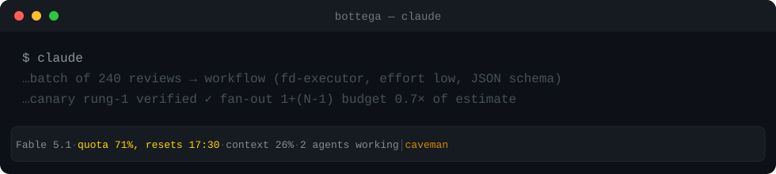

# The statusline

One glance at model, context and plan quotas — so you see the rate limit coming
**before** it hits.



```
✦ FABLE 5·max · ctx ▓▓▓░░░░░ 26%/1M · cmp 1 · 5H 71% 17:30 · 7D 46% 14 Jul · fail ×3 │ caveman
└ bdg ▓░░ 0.7×·high · dlg ≡ 41k · xf gemini 2/1500 09:00 · cache ◕ 47m
```

Row 1 is *what you are* — always present. Row 2 is *what is happening* (open
budget, delegations, external calls, cache): it appears only while there's
activity, so at rest the line stays single.

**Turn it on:** `/fable-director:statusline`, then restart Claude Code.
Idempotent, backs up `settings.json`, won't touch a third-party statusLine
already there; `--remove` takes it out.

**No terminal statusline** (phone, web client): `/fable-director:status` prints
the same state as a box-drawn bulletin — open budget, live spend ratio, quota
bars, a burn-rate sparkline from the quota history, honest freshness labels.
`--detail` adds session delegations and the last task receipt.

## The one rule: half-light when healthy, full words when broken

Everything that's fine sits in quiet grey. Colour is reserved for what deviates:
a quota past 60%, a session running at `xhigh`/`max` effort, a budget past its
checkpoint. Alarms are full words with text markers that survive terminals
without colour.

At 3× — or with enforcement broken — the alarm **takes over**: a solid-red block
at the head of the line, everything else dropping to half-light.

## The segments

| Segment | What it tells you |
|---|---|
| `✦ FABLE 5·max` | Which model is driving the session, and its **live** reasoning effort: yellow from `xhigh` up, because a forgotten `/effort max` burns quota silently |
| `ctx ▓▓▓░░░░░ 26%/1M` | How full the context window is, as an 8-cell gauge; `/1M` marks an extended window (26% of 1M is not 26% of 200k) |
| `cmp 1` | How many times context was compacted this session (each one dropped history); hidden until the first |
| `5H 71% 17:30` | Your 5-hour plan quota used, and when it resets — the time sits apart in deeper half-light, no arrow: `17:30` announces itself as a time by its own shape |
| `7D 46% 14 Jul` | Your weekly plan quota used, and the day it resets |
| `bdg ▓░░ 0.7×·high` | Current task spend vs the estimate it declared, on the 0–3× checkpoint scale; becomes a full-word alarm at 2× and 3× |
| `fail ×3` | Bash commands failing in a row — a sign you're grinding; shows from 2, red at 3 |
| `cache ◕ 47m` | How long the prompt cache stays warm, as a draining quarter-clock. It claims row 2 for itself only in the last 10 minutes, when the timing of a delegation actually changes |
| `xf gemini 2/1500 09:00` | Free external calls used vs the provider's daily tier, counted in the **provider's own** reset window, then when it refills (declared per provider; without it, plain `×N` and no invented time). Lights up while a call is in flight |
| `dlg ⟲2 ≡ 41k` | Work handed to cheaper models this session, and how much (`≡` = same model as the main loop); `⟲N` = delegations **in flight right now**, nested included |
| `✦≤26%` | Ceiling on your premium model's weekly window (declared fraction of the 7D quota, e.g. Fable = 50%); shown only while that model drives the session — always a bound, never invented telemetry |
| `pr #42` | Open PR for the branch, colour = review state; Ctrl+click opens it (links are opt-in) |
| `caveman` | The caveman plugin's badge, re-dressed in the zen theme. It rides at the tail and is the first thing dropped when the terminal narrows — a state you set yourself is worth less than a number you'd lose; any other statusline badge passes through untouched |

## Refresh and narrow terminals

Updates are event-driven, and event triggers go quiet exactly while a
coordinator waits on background subagents — the minutes when the budget climbs
and the in-flight count is the only thing you'd want to see. Since 1.29.0 the
installer also writes `refreshInterval: 5` (seconds) so the line keeps breathing
during the wait; `FD_STATUSLINE_REFRESH=<n>` changes it, `0` turns it off.

On narrow screens (real terminal width via `COLUMNS`) both rows trim by the same
rule — **decoration goes, data stays**. Row 1 drops the `caveman` badge, then
the `ctx` gauge, then the reset times; the model, every percentage and every
alarm survive at any width. Row 2 drops `cache`, then `dlg`, then `xf`, and
never the budget.

Segments can become clickable (opt-in, off by default — some webview terminals
open links in place and would kill the session; the legend ships a safe test):
quotas link to your plan's usage page, `xf` to the AI Studio dashboard, `pr` to
the pull request, the model to the Anthropic status page.

**Full spec** — every alarm state, colour threshold and `[BDG]`/`[XF]`
sub-state — is one command away in-session: `/fable-director:help`. It ships
with the plugin, so it never drifts from the code. This page is the intro.
